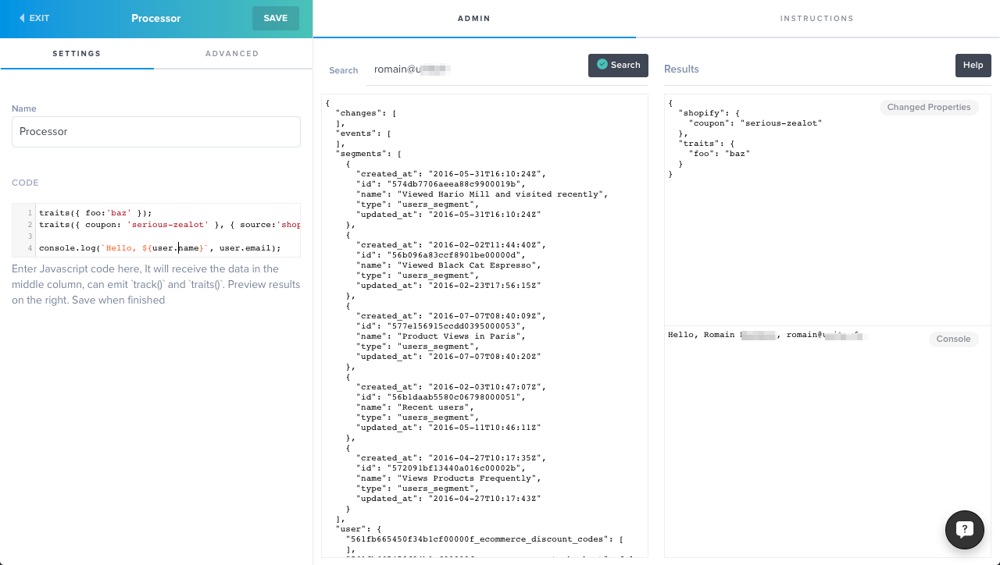

# Processor

### This ship lets you process user data

Add & edit properties and emit new events. Users will pass through this code everytime they are updated or generate events.

**Actions are micro-batched:** The code will **not** run every time an Event is recorded, but rather wait and receive several events at once.

When a User is updated, Processor will receive it along with all the events performed since the last batch. Events are sent exactly once.

> It is up to you to avoid infinite loops: Those calls count against your quotas and can burn through it pretty quickly.



## Left Column
A sample user with all his/her properties, segments, account, latest events and changes since last recompute. You can search for a specific user. 

---

## Center Column
Write Javascript code to manipulate data, call `hull.track()` and `hull.traits()` to update User. ES6 is supported. You can't use asynchronous code and external libraries. We provide several utilities out of the box. see below.

Example: 
```js
console.log(`Hello ${user.name}`);
hull.traits({ coconuts: 12, swallows: 12 });
hull.traits({ coconuts: 13 });
hull.traits({ coconuts: 14 }, { source: 'clearbit' });

//BEWARE - if you apply a trait operation (such as 'inc')
//without a if() condition, you trigger an infinite loop;
hull.traits({ swallows: { operation: 'inc', value: 2 } });

//BEWARE - if you track() without a if() condition
//you trigger an infinite loop.
if(false) { hull.track("Viewed Monthy Python", { coconuts: 12 });}
```

##### You can apply [Traits operations](https://github.com/hull/hull-node/blob/master/README.md#usertraitsproperties-context)
Be careful to not apply trait operations (such as increments) unconditionally otherwise you'll end up with an infinite increment loop.

##### You can emit up to 10 tracking events with [hull.track()](https://github.com/hull/hull-node/blob/master/README.md#usertrackevent-props-context)
Be careful to not generate events unconditionally otherwise you'll end up with an infinite loop of events and recomputations.

---

## Right Column
A preview of the updated user, a summary of the changes that would be applied and eventual logs and errors from the console

- When you're satisfied, click **Save**.
- Code will start running for each newly modified user once saved.
- Code will not back-process users who don't change.
- You can trigger a batch from the dashboard to force a pass of processing
- For Batches, Events won't be sent again

---

## Variables and libraries

| Function or Variable                   | Description                                                                |
|----------------------------------------|----------------------------------------------------------------------------|
| `ship`                                 | The Ship's data. Can be used to store additional data                      |
| `user`                                 | The User data (as seen on the left column)                                 |
| `account`                              | The User Account data (as seen on the left column)                         |
| `changes`                              | An object of all the changed properties since last recompute               |
| `events`                               | An Array of all the events since last recompute                            |
| `segments`                             | An Array of the segments the user belongs to.                              |
| `account_segments`                     | An Array of the segments the user's account belongs to.                    |
| `hull.traits(properties, context)`     | A method to Update User Traits. Optionally define a `context` with a `source` key to save in a custom group. |
| `hull.track('Event Name', properties)` | A method to generate new Events for the user. Can be used at most 10 times in a single run of the processor. |
| `hull.account(claims)`                 | A method to link the Account claimed to this User.                         |
| `hull.account(claims).traits(properties, context)` | A method to Update Account Traits. If `claims` is defined, the claimed Account will be created/updated and linked to the User, else if `claims` is `null`, the Account belonging to this User will be updated. Optionally define a `context` with a `source` key to save in a custom group. |
| `hull.account(claims).track('Event Name', properties)` | A method to generate new Events for the Account.  If `claims` is defined, the claimed Account will be created/updated and linked to the User, else if `claims` is `null`, the Account belonging to this User will be updated. Can be used at most 10 times in a single run of the processor. |
| `isInSegment('Segment')`               | A convenience method to easily define if the user is a member of a given   |
|                                        | segment.                                                                   |
| `moment()`.                            | The Moment.js library.                                                     |
| `URI()`                                | The URI.js library.                                                        |
| `_`                                    | The lodash library.                                                        |
